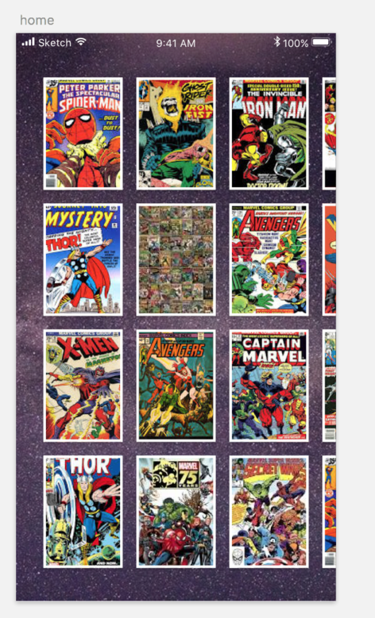

# Streetbees iOS developer challenge 

## Description
Using the best API available on this side of the universe [https://developer.marvel.com/](https://developer.marvel.com/) make a simple master detail app that allows the user to scroll through all the comics ever released and view details for each comic.

You will need to sign up for a free developer account with Marvel.

## Functional requirements

- When I open the application I want to see a list of all Marvel’s released comic books
- When tapping on a comic it should open up a modal view controller showing the cover art full screen

Feel free to use whatever flare you can to show off your skills.

## Design

## Technical requirements

Application must be developed support iOS 10, the code can be written with Swift 4+.

## Evaluation Criteria
- Adaptability. We want to see how well you can develop for the different screen sizes.
- You create maintainable code
- You create testable code
- You care about the user experience
- You pay attention to detail
- You develop in a scalable manner

### Deliverables
- The forked version of this repo
